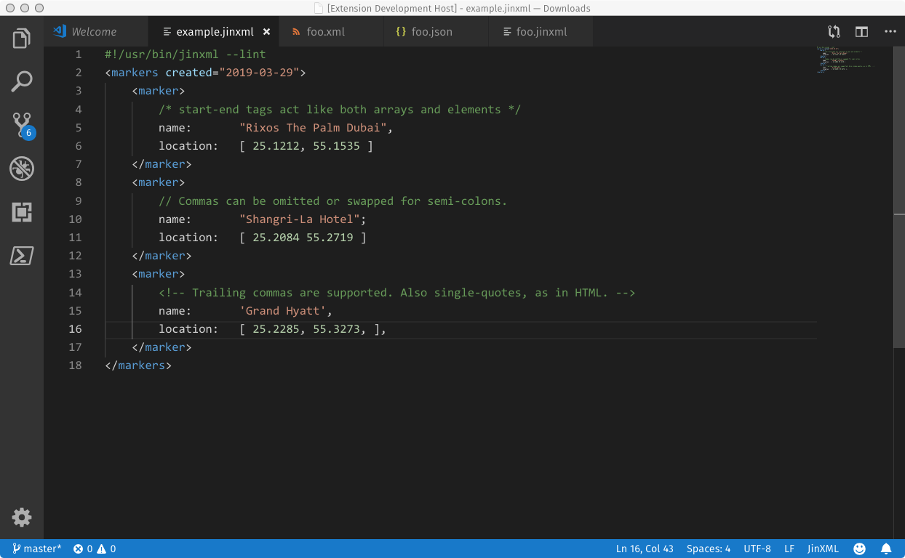

# jinxml-extension README

This extension adds syntax-highlighting to your JinXML files (extension \*.jinxml). It is released under [GPL3](https://www.gnu.org/licenses/gpl-3.0.en.html).

## Features

After installation, syntax highlighting will be automatically applied to `*.jinxml` files. 

## Troubleshooting & Known Issues

If something doesn't look right please raise an issue on the [main JinXML project](https://github.com/sfkleach/JinXML) or just message me directly on keybase @sfkleach.

This extension is useful but somewhat limited. It does not enforce matching tag-names, identify the inappropriate use of ditto-tags, give the most specific classification of keys/selectors when they are quoted, recognise iterated escape sequences such as &\&\&\n. Nor does it include any features that are scheduled for JinXML v2 or v3.

------------

[CHANGELOG](CHANGELOG.md) | [LICENSE](LICENSE)
